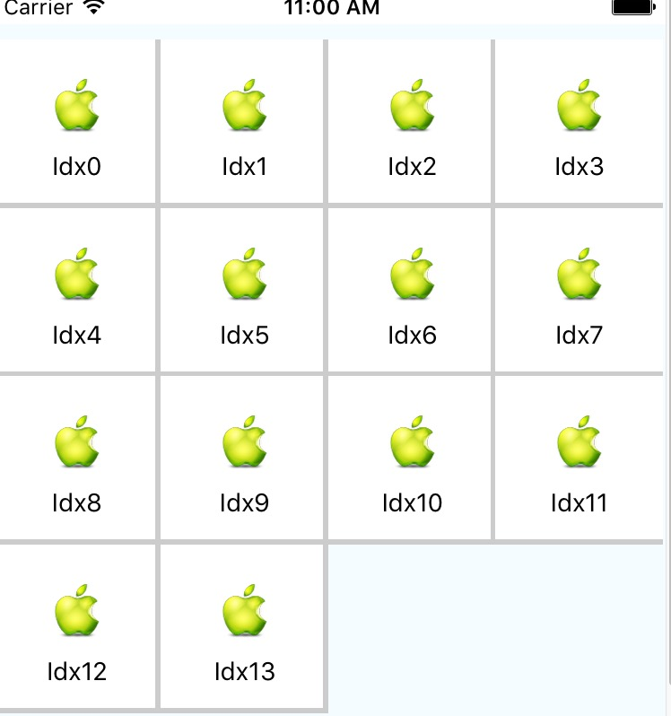

# ReactNativeGridDemo

React Native 实现格子效果

```
git clone git@github.com:tengontheway/ReactNativeGridDemo.git
cd ReactNativeGridDemo
npm install
```

## GridDemo1分支,实现但无法重用
```
git checkout GridDemo1
react-native run-ios
```


## GridDemo2分支
```
git checkout GridDemo2
react-native run-ios
```


